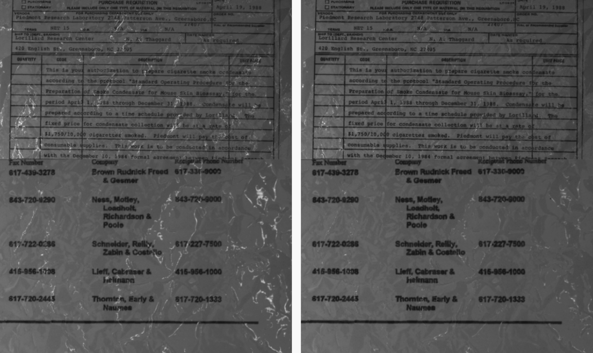

# SHDocs

This is the official repository of SHDocs: A dataset, benchmark, and method to efficiently generate high-quality, real-world specular highlight data with near-perfect alignment.

Abstract:

> A frequent problem in vision-based reasoning tasks such as object detection and optical character recognition (OCR) is the persistence of specular highlights. Specular highlights appear as bright spots of glare that occur due to the concentrated reflection of light; these spots manifest as image artifacts which occlude computer vision models and are challenging to reconstruct. Despite this, specular highlight removal receives relatively little attention due to the difficulty of acquiring high-quality, real-world data. We introduce a method to generate specular highlight data with near-perfect alignment and present SHDocs—a dataset of specular highlights on document images created using our method. Through our benchmark, we demonstrate that our dataset enables us to surpass the performance of state-of-the-art specular highlight removal models and downstream OCR tasks. We release our dataset, code, and methods publicly to motivate further exploration of image enhancement for practical computer vision challenges.

## SHDocs dataset

### Dataset

Our dataset is built on top of the [FUNSD dataset](https://guillaumejaume.github.io/FUNSD/) and comprises 3184 scenes with 19104 images. We collect document images in different specularity conditions and provide a ground truth deglared counterfactual for use in specular highlight removal and image enhancement tasks.

SHDocs can be downloaded from the following links (~13.5 GB):

- SHDocs raw data: [Microsoft OneDrive](https://hometeamsnt-my.sharepoint.com/:u:/g/personal/jovin_leong_hometeamsnt_onmicrosoft_com/EcJDKkwv5_BKk4T7E2-A0qsB06zOpMj-wywW7bz1v3wF-w?e=2u4cHQ) or [Google Drive](https://drive.google.com/file/d/1J5OekUKSCrcqfXLzCMkgae7nPLd-5WCN/view?usp=sharing)
- SHDocs processed data: [Microsoft OneDrive](https://hometeamsnt-my.sharepoint.com/:u:/g/personal/jovin_leong_hometeamsnt_onmicrosoft_com/EY_m6N_VApVKhBOFZe-4rNYB_r0W1FExQT6WHDO77Rti0A?e=lLxmYM) or [Google Drive](https://drive.google.com/file/d/1zotvR5kAfYz5564C0QvuExIksmNtuPst/view?usp=sharing)



### Method

Our work includes a [data collection](#image-capture) and [data processing](#process-data) method that can be used to similarly generate specular highlight data.


Image captures are taken using our custom application, processed, and aligned with FUNSD annotations. These images can then be enhanced and evaluated in terms of both image quality and OCR metrics for specular highlight/image enhancement benchmarking.

## Prerequisites

We recommend creating a virtual environment using ```venv``` or ```conda``` to manage your Python libraries and dependencies.

Next, install the dependencies using:

```{bash}
pip install requirements.txt
```

Note that not all dependencies are required if you only use some of the below features.

## Train

As described in the paper, the model we used was [MIMO-UNetPlus](https://github.com/chosj95/MIMO-UNet). Instructions, initial weights, and the code to retrain MIMO-UNetPlus on SHDocs can be found [here](https://github.com/chosj95/MIMO-UNet?tab=readme-ov-file#train).

The model along with details on how to train and enhance using said model are detailed in the [```model```](https://github.com/JovinLeong/SHDocs/tree/main/model) directory.

## Enhance

To enhance images using the MIMO-UNet model retrained on SHDocs, you can use [MIMO-UNet's testing function](https://github.com/chosj95/MIMO-UNet?tab=readme-ov-file#test) with ```--save_image=True```.

[The weights used in the paper can be found here](https://hometeamsnt-my.sharepoint.com/:u:/g/personal/jovin_leong_hometeamsnt_onmicrosoft_com/EQNbX5o3r_tBg19zlIO2mlYB4iLxUTHKJmB2sm4s52_gMQ?e=9cxj4h).

Alternatively, details on how to enhance images using the model described in the paper are detailed in the [```model```](https://github.com/JovinLeong/SHDocs/tree/main/model) directory.

## OCR inference

To perform OCR inference, you will first need to obtain the necessary keys to call the appropriate enterprise models. The OCR models supported by our code are AWS Textract, Azure Document Intelligence, Tesseract, and EasyOCR. Enterprise options from AWS and Azure will likely incur charges.

For Azure Document Intelligence, follow [this guide](https://learn.microsoft.com/en-us/azure/ai-services/document-intelligence/how-to-guides/use-sdk-rest-api) to get your API key and endpoint. Once you have your Azure Document Intelligence API key, make an environment file titled ```.env``` and update the values accordingly. Ensure that the ```.env``` file follows the same structure as the ```.env.example``` file provided.

Meanwhile, for Azure Textract, instructions to set up your AWS credentials can be found [here](https://docs.aws.amazon.com/cli/v1/userguide/cli-configure-files.html).

With that done, you can call on the function and specify the model, inference method, and data on which you'd like to perform OCR inference. e.g.:

```{bash}
python inference_ocr.py --input_dir 'data/enhanced_images_crops/mimo/images' --dataset 'shdocs dataset mimo enhanced testing data' --model 'document_intelligence' --method 'batched'
```

Or

```{bash}
python inference_ocr.py --input_dir 'data/enhanced_images_crops/mimo/images' --dataset 'shdocs dataset mimo enhanced testing data' --model 'tesseract'
```

Batched inference is recommended if you are performing inference on a large number of crops with either Azure or AWS due to the latency involved in sending many requests.

Prior to OCR inference, the directory structure can be made easier to work with through the use of the ```restructure_captures``` function in [```utils/image_utils.py```](https://github.com/JovinLeong/SHDocs/blob/main/utils/image_utils.py).

## Evaluation

Two types of evaluation options are available as described in our paper: image quality evaluation and OCR evaluation.

### Image quality evaluation

Image quality evaluation looks at a directory of target images and a directory of ground truths and then evaluates the target images against the ground truth using [PSNR](https://lightning.ai/docs/torchmetrics/stable/image/peak_signal_noise_ratio.html), [SSIM](https://lightning.ai/docs/torchmetrics/stable/image/structural_similarity.html), and [UIQI](https://lightning.ai/docs/torchmetrics/stable/image/universal_image_quality_index.html) as implemented by [Lightning AI's Torchmetrics](https://lightning.ai/docs/torchmetrics/stable/).

To perform image quality evaluation, run:

```{bash}
python image_quality_evaluation.py -g <path to ground truth> -e <path to evaluation target> -o <description> -m <model name>
```

e.g.

```{bash}
python image_quality_evaluation.py -g 'data/shdocs_dataset/restructured/testing_data/deglared' -e 'data/mimo_enhanced/' -o 'evaluation of mimo enhanced outputs' -m 'mimo'
```

Prior to evaluation, the directory structure can be made easier to work with through the use of the ```restructure_captures``` function in [```utils/image_utils.py```](https://github.com/JovinLeong/SHDocs/blob/main/utils/image_utils.py).

### OCR evaluation

OCR evaluation takes the outputs of the [OCR inference](#ocr-inference) and compares them to the annotations obtained during [cropping](#cropping-images-to-ocr-annotations) and then evaluates the predicted text to the ground truth using [WER](https://lightning.ai/docs/torchmetrics/stable/text/word_error_rate.html), [CER](https://lightning.ai/docs/torchmetrics/stable/text/char_error_rate.html), and [Levenshtein edit distance](https://lightning.ai/docs/torchmetrics/stable/text/edit.html) as implemented by [Lightning AI's Torchmetrics](https://lightning.ai/docs/torchmetrics/stable/).

To perform OCR evaluation, run:

```{bash}
python ocr_evaluation.py --annotation_dir <path to FUNSD crop annotations> --inference_outputs_directory <path to OCR inference outputs> --evaluation_objective <description of the evaluation objective> --output_dir <directory to output evaluations>
```

e.g.

```{bash}
python ocr_evaluation.py --annotation_dir data/outputs/enhanced_images_crops/mimo/annotations --inference_outputs_directory data/outputs/inference_mimo_pure_crops --evaluation_objective "shdocs_eval_mimo_pure_enhancement" --output_dir data/outputs/ocr_evaluations
```

## Image capture

To use our GUI and scripts to capture aligned specular highlight data, follow the instructions in the [polarcam directory](https://github.com/JovinLeong/SHDocs/tree/main/polarcam).

## Process data

Several data processing capabilities are included in our data processing scripts.

### Determining image adjustment

After [capturing images](#image-capture), it is necessary to scale and adjust the image capture to ensure that it aligns with the FUNSD annotations. This is necessary for OCR evaluation, as it ensures that the positions of the text are aligned with that of the FUNSD annotations and enables us to compute the OCR metrics of OCR inference outcomes on the enhanced images.

To do this, we have developed an OpenCV-based tool to visualize and adjust the images using keyboard controls and store the adjustments in a JSON file such that the adjustments can be applied to the image.

The tool overlays the FUNSD annotations over the captured image and allows you to use your keyboard to rotate, zoom, pan, and crop the captured image until it aligns with the annotations. Then, these settings are stored and an adjusted image is stored in the target directory. Instructions on the controls are detailed within the script itself.

To use the tool, go to the ```utils``` directory and run:

```{bash}
python adjust_image.py --document_name <name of document> --raw_document_directory <path to documents to be adjusted> --processed_document_directory <path to documents that have been processed> --annotation_directory <path to annotations> --metadata_path <path to metadata>
```

e.g.

```{bash}
python adjust_image.py --document_name 82253362_3364 --raw_document_directory '../data/shdocs_dataset/raw_captures/training_data/images' --processed_document_directory '../data/shdocs_dataset/processed_captures/training_data/images' --annotation_directory '../data/shdocs_dataset/processed_captures/training_data/annotations' --metadata_path "image_adjustments_metadata.json"
```

### Applying image adjustments

This functionality enables the use of past adjustment metadata files to process all raw documents. Our adjustment metadata is included [here](https://github.com/JovinLeong/SHDocs/blob/main/utils/image_adjustment_metadata/scaling_metadata.json). To apply past adjustments, go to the ```utils``` directory and run:

```{bash}
python apply_image_adjustments.py --metadata <path to metadata> --image_directory <path to image directory> --output_directory <path to output directory>
```

e.g.

```{bash}
python apply_image_adjustments.py --metadata './image_adjustment_metadata/scaling_metadata.json' --image_directory '../data/shdocs_dataset/raw_captures/testing_data/images' --output_directory <path to output directory>
```

Note that for now, we only provide the scaling metadata for the SHDocs testing set since that is the only set which requires alignment to text annotations. However, we will be rolling out scaling metadata for the training set shortly.

### Cropping images to OCR annotations

Once images have been aligned to the FUNSD annotations they can be cropped based on their bounding boxes such that these crops can be passed into the OCR models for inference. The script used is based heavily on the work of [Ricciuti Federico](https://github.com/OCRComparison/dataset).

To apply crop images based on their OCR annotations, go to the ```utils``` directory and run:

```{bash}
python crop_funsd_documents.py --input_path <path to data and annotations formatted as per FUNSD> --output_path <path to where the crops should reside>   --bbox_buffer=<number of pixels to buffer bboxes> --dataset=<dataset type>
```

e.g.

```{bash}
python crop_funsd_documents.py --input_path ../data/shdocs_dataset/processed_captures --output_path ../data/shdocs_dataset_crops/s0_norm   --bbox_buffer=1 --dataset="s0_norm"
```

## Citation

TODO: Update
